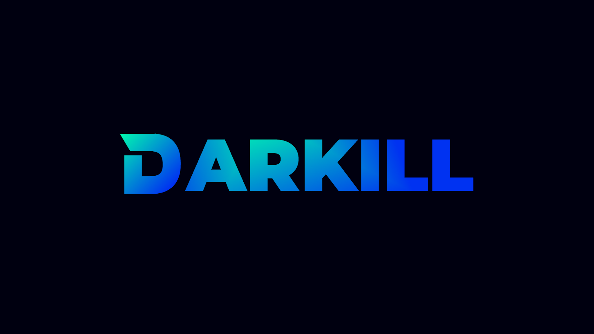

<!---->
<h1 align="center">Présentation</h1>

  
  

<h1>Me contacter:</h1>
mail: <a href="mailto:mail.darkill@gmail.com" target="_blank">mail.darkill@gmail.com</a>   
discord: <a href="https://discordapp.com/users/817814016096206879 target="_blank">@darkill</a>   
twitter: <a href="https://twitter.com/darkill59" target="_blank">@darkill59</a>
   
<h1>Mes projets:</h1>
(soon)   
   
<h1>Mes statistiques:</h1>

  <picture>
    <source
      srcset="https://github-readme-stats.vercel.app/api?username=darkill59&show_icons=true&theme=algolia"
      media="(prefers-color-scheme: dark)"
    />
    <source
      srcset="https://github-readme-stats.vercel.app/api?username=darkill59&show_icons=true&theme=algolia&hide=prs"
      media="(prefers-color-scheme: light), (prefers-color-scheme: no-preference)"
    />
    
  </picture>
  

    
  

